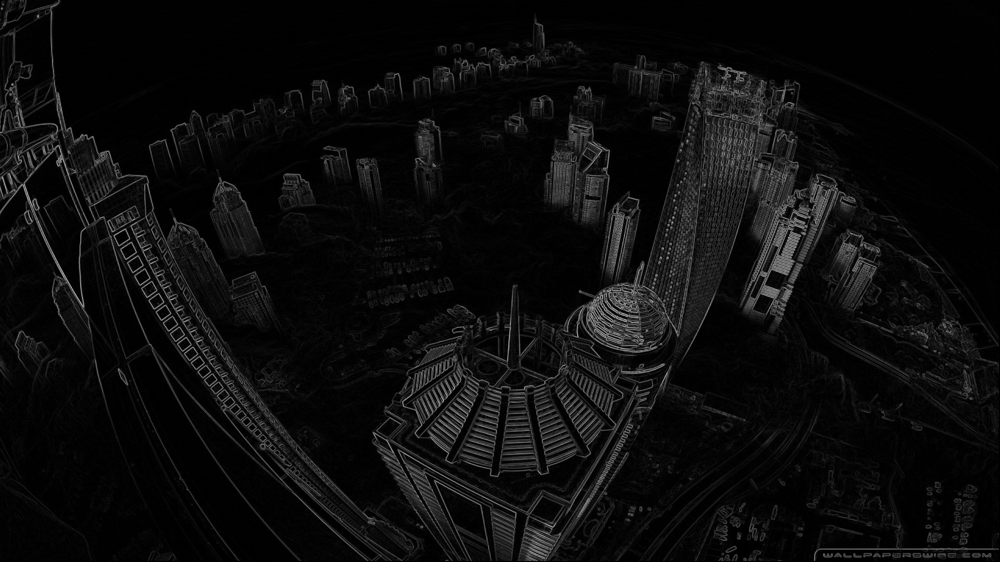

<h1 align="center">Sobel filter - Cuda</h1> 

📐 Parallelization and implementation of the Sobel filter for edge detection in CUDA. 📏

<h1 align="center">Showcase</h1>

<h1 align="center">Execution time</h1>

## By Pascal Canuel

